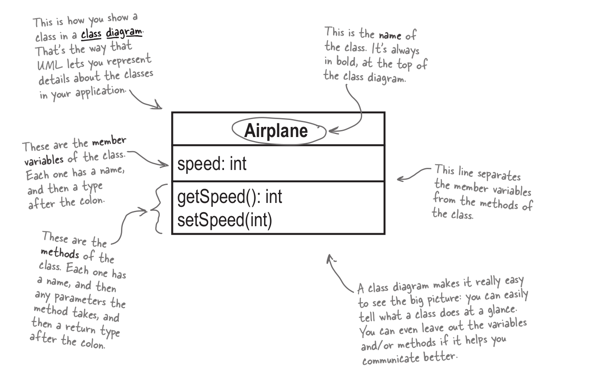

# Intro To OO
## Content
- [***UML***](https://github.com/m7moudGadallah/Head-First-Object-oriented-Analysis-Design-breif/tree/main/00.Intro%20To%20OO#uml)
- [***Inheritance***](https://github.com/m7moudGadallah/Head-First-Object-oriented-Analysis-Design-breif/tree/main/00.Intro%20To%20OO#inheritance)
- [***Polymorphism***](https://github.com/m7moudGadallah/Head-First-Object-oriented-Analysis-Design-breif/tree/main/00.Intro%20To%20OO#polymorphism)
- [***Encapsulation***](https://github.com/m7moudGadallah/Head-First-Object-oriented-Analysis-Design-breif/tree/main/00.Intro%20To%20OO#encapsulation)

---


## UML
- Unified Modeling Language
- it is a language used to communicate just the details about your code and application's structure that other devlopers and customers need, without getting details that aren't neccessary
- Class Digram gives you an overview of our class, including it's methods and variables


---
## Inheritance
- means new class extends another existing class to reuse or build upon the inherited class's behavior
- **superclass** class being inherited from also called (parent)
- **subclass** class is doing inheritance also called (child)
- subclass gets all behaviors or the super calss automatically and can `override` it and also it have it's own behaviors

***Example*** : in this example, class `Airplan` is *superclass* and `jet` is *subclass* and `Main` is the main class to run program
`````java
public class Airplan
{
    private int speed;
    
    public Airplan()
    {}

    public void setSpeed(int speed)
    {
        this.speed = speed;
    }

    public int getSpeed()
    {
        return this.speed;
    }
}

public class Jet extends Airplan
{
    private static final int MULTIPLIER = 2;

    public Jet()
    {
        super();
    }

    public void setSpeed(int speed)
    {
        super.setSpeed(speed * MULTIPLIER);
    }

    public void accelerate()
    {
        super.setSpeed(getSpeed() * 2);
    }
}

public class Main
{
    public static void main(String[] args)
    {
        Airplan biplane = new Airplan();
        biplane.setSpeed(212);
        System.out.println(biplane.getSpeed());

        Jet boeing = new Jet();
        boeing.setSpeed(422);
        System.out.println(boeing.getSpeed());

        int x = 0;

        while (x < 4)
        {
            boeing.accelerate();

            System.out.println(boeing.getSpeed());

            if (boeing.getSpeed() > 5000)
            {
                biplane.setSpeed(biplane.getSpeed() * 2);
            }
            else
            {
                boeing.accelerate();
            }

            ++x;
        }

        System.out.println(biplane.getSpeed());
    }
}
`````
> output:
> 6752
> 13504
> 27008
> 1696


----
## Polymorphism
- having many forms
- allows your applications to be more flexible and less resistant to cahng
- there is 2 types :
  - ***Static*** "Overloading" : this type in Compile-time
  - ***Dynamic*** "Overriding" : this type in run-time
  
>as a Example of overide go back to previous example
so you find that class jet override of  `setSpeed` function

---
## Encapsulation
- means warpping data in single unit and we can hide one part of code from rest of code
- simple way of `Encapsulation` is when we hide `class` attributes and access them with methods like  `getter` and `setter` methods
- not just hiding attributes, we can also hide methods

***Example***
```java
public class Airplan
{
    private int speed;          //make speed attribute private
    
    public Airplan()
    {}

    public void setSpeed(int speed) //setter method for speed
    {
        this.speed = speed;
    }

    public int getSpeed()   //getter method for speed
    {
        return this.speed;
    }
}


public class Main
{
    public static void main(String[] args)
    {
        Airplan biplane = new Airplan();
        
        biplane.setSpeed(10);   //invoking setter method

        System.out.println(biplane.getSpeed()); //invoking getter method
    }
}
```
> Ouput:
> 10