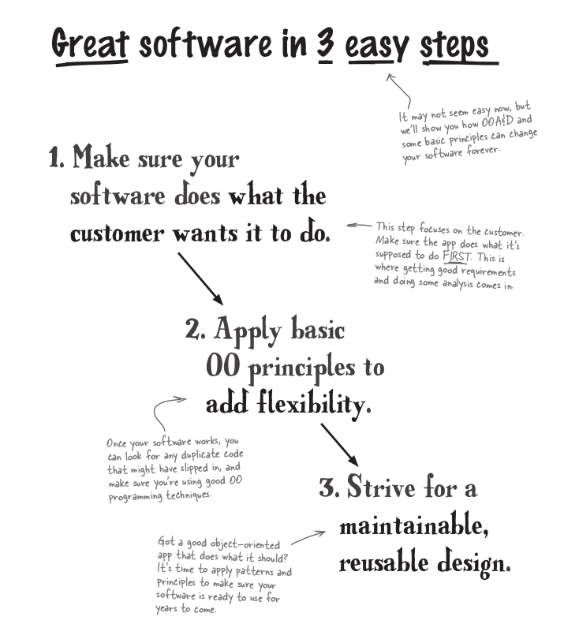

# 1. well-designed apps rock

## Great Software

**Great software is...
more than on thing**

- great software must staisfy the customer. the software must do what the customer wnats it to do
- great software is well-designed, well-coded, and easy to maintain, reuse, and extend

> ***💡Hint***
> if we have a lot of strings attributes in our class may be we face the problem of Sting comparisons so we can use enumerated types `enum` as in our [**GuitarInventory**](GuitarInventory/Program/) program we use `enum` with [Builder](GuitarInventory/Program/myUtil/Builder.java) and [Type](GuitarInventory/Program/myUtil/Type.java) and [Wood](GuitarInventory/Program/myUtil/Wood.java)

**so what is enum?**
- is type (special class) that repesent a group of constants
- enum achieve **type saftey** and **value saftey**

## Objects
**1. Objects should do what their names indicate**
If an object is named Jet, it should probably takeOff() and land(), but it shouldn’t takeTicket()—that’s the job of another object, and doesn’t belong in Jet.

**2. Each object should represent a single concept**
You don’t want objects serving double or triple duty. Avoid a Duck object that represents a real quacking duck, a yellow plastic duck, and someone dropping their head down to avoid getting hit by a baseball.

**3. Unused properties are a dead giveaway**
If you’ve got an object that is being used with no-value or null properties often, you’ve probably got an object doing more than one job. If you rarely have values for a certain property, why is that property part of the object?
Would there be a better object to use with just a subset of those properties? **in this case we use [Encapsulation](https://github.com/m7moudGadallah/Head-First-Object-oriented-Analysis-Design-breif/tree/main/01.Chapter%201.well-designed%20apps%20rock#encapsulation)**

## Encapsulation
- it's defined as wrapping up of data under a single unit
- Encapsulation is breaking your application into logical
parts that have a clear boundary that allows an object to
hide its data and methods from other objects.

**💡Hint**
- Encapsulation is not only to make your calss attributes hidden and use getter and setters funtion *Nope* it's also a way to ***avoid duplicate code*** as Example for that [GuitarSpec class](GuitarInventory/Program/myUtil/GuitarSpec.java) we make this class to Encasulate all guitar specs that user intersed about it and `reference` it in [Guitar class](GuitarInventory/Program/myUtil/Guitar.java) so now we can use `GuitarSpec` object with serach tool effiectively

***so if we have duplicate code we use Encapsulation***

## Delegation
- Delegation means an object asked another object to perform a certain task instead of doing that task directly
- Delegation lets each object worry about itself. This means ***your objects are more independent of each other, or more lossely coupled***

**what is the meaning of lossely coupled**
- means each object in your application have a specific job to do, and they do only that job.
- Lossely coupled objects can be taken from one app and easily reused in another, *because they're not tightly tied to other object's code*

***so we use delegation to make our objects independent of each other***

as Example of  that `search` method in [Inventory class](GuitarInventory/Program/myUtil/Inventory.java) delegate with `matches` function in [GuitarSpec class](GuitarInventory/Program/myUtil/GuitarSpec.java)

## Important Definitions
Functionality
: Way to make you customer happy by make your applicatoin satisfying their requirments, No matter how well-designed your application is.

Flexibility
: Way to make your software can change and grow without constant rework and keep you application from being fragile (robust).

Encapsulation
: Way to keep the parts of your code that stay the same sparate from the parts that change then it' really easy to make changes to you code without breaking everything.

Design Pattern
: Is about reuse and making sure you're not trying to solve a problem that someone else has already figured out.

